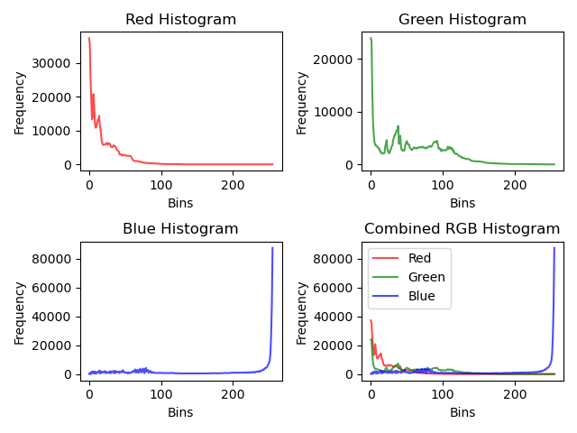
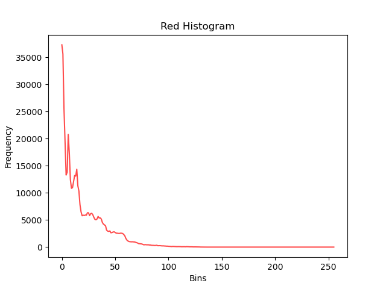
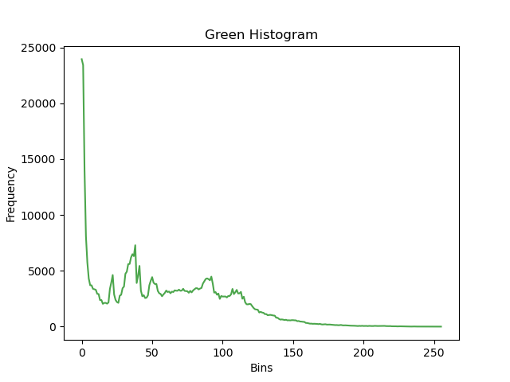
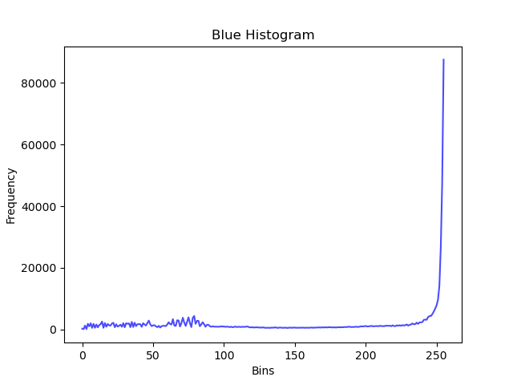

# color-histogram


画像から Color histogram を取得し画像として保存

## Demo

| Original                                          | histogram                                               |
| ------------------------------------------------- | ------------------------------------------------------- |
|  |  |

| R-histogram                                                  | G-histogram                                                    | B-histogram                                                   |
| ------------------------------------------------------------ | -------------------------------------------------------------- | ------------------------------------------------------------- |
|  |  |  |

## Installation

```bash
git clone https://github.com/kkml4220/color-histogram.git
cd color-histogram
pip install -r requirements.txt
```

## Usage

```bash
python main.py input/sample_background.png
```

## Author

- 作成者 : 高橋 克征 (Takahashi Katsuyuki)
- E-mail : [Takahashi.Katsuyuki.github@gmail.com](Takahashi.Katsuyuki.github@gmail.com)

## License

"color-histogram" is under [MIT license](https://en.wikipedia.org/wiki/MIT_License).
